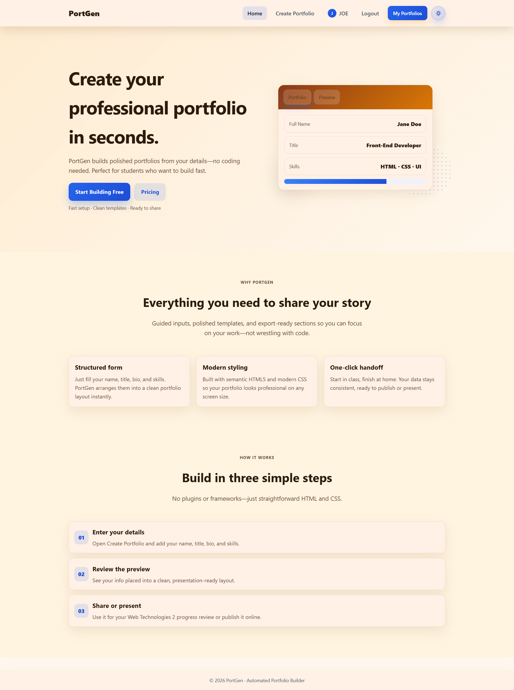

# PortGen - Dynamic Portfolio Builder

PortGen is an automated web-based application built using PHP and MySQL that allows users to quickly build, edit, and manage personalized portfolio websites. It features user authentication, a form-based dynamic builder, and persistent database storage.

## Features
- **User Authentication:** Secure signup, login, and session tracking (`signup.php`, `login.php`).
- **Dynamic Portfolio Builder:** Form-driven creation and editing tool (`builder.php`, `edit-portfolio.php`).
- **Dashboard & Portfolio Viewer:** View saved portfolio entries and individual profile pages (`my-portfolios.php`, `view.php`).
- **Data Persistence:** Relational database logging and record management via MySQL (`db.php`).

## Tech Stack
- **Backend:** PHP
- **Database:** MySQL
- **Frontend:** HTML5, CSS3 (`style.css`), JavaScript

## Setup & Local Installation

1. **Clone the Repository:**
   git clone https://github.com/Ashad-001/portgen.git

2. **Server Configuration (XAMPP):**
   - Move the project directory to your web server root (e.g., C:\xampp\htdocs\portgen).
   - Start Apache and MySQL in the XAMPP Control Panel.
   - Import or create the database `portgen_db` in phpMyAdmin.
   - Ensure local database configuration in `db.php` matches your local server credentials:
     $host = 'localhost';$user = 'root';
     $pass = '';$dbname = 'portgen_db';

3. **Access the Application:**
   - Navigate to http://localhost/portgen/index.html or http://localhost/portgen/index.php in your browser.

d. Scroll to the bottom and click "Commit changes...".

2. UPLOAD SCREENSHOT DEMO
-------------------------
a. Take a clean screenshot of your generated portfolio or the builder page running at http://localhost/WEB TECH/index.html.
b. Save the file on your computer as "demo.png".
c. On your repository home page (https://github.com/Ashad-001/portgen), click "Add file" -> "Upload files".
d. Drag and drop "demo.png" into the box and click "Commit changes...".

3. ADD REPOSITORY TOPICS & TAGS
--------------------------------
a. Go to your repository home page: https://github.com/Ashad-001/portgen
b. Look at the right sidebar under the "About" section.
c. Click the ⚙️ gear icon next to "About".
d. In the "Topics" field, add the following tags:
   php, mysql, portfolio-generator, web-development, full-stack, xampp
e. Click "Save changes".
================================================================================
